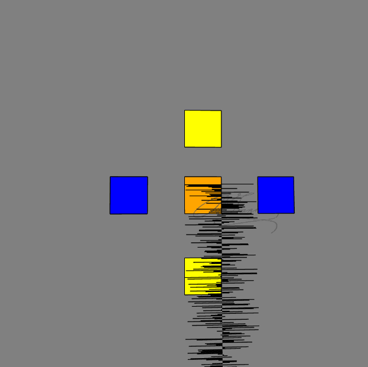

# Processing 

The best friendly [introduction](https://p5js.org/get-started/). So, there is a [p5.vscode](https://marketplace.visualstudio.com/items?itemName=samplavigne.p5-vscode) extension for run in local server.

Output sketch.js:
> 

<!-- Date: 04/30/2022 -->